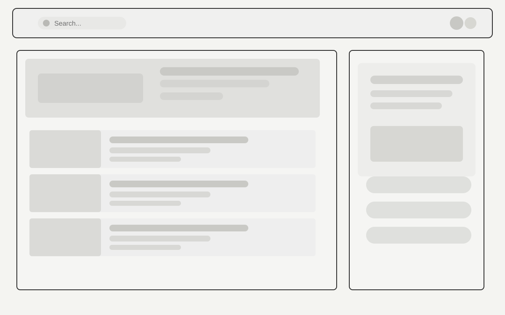
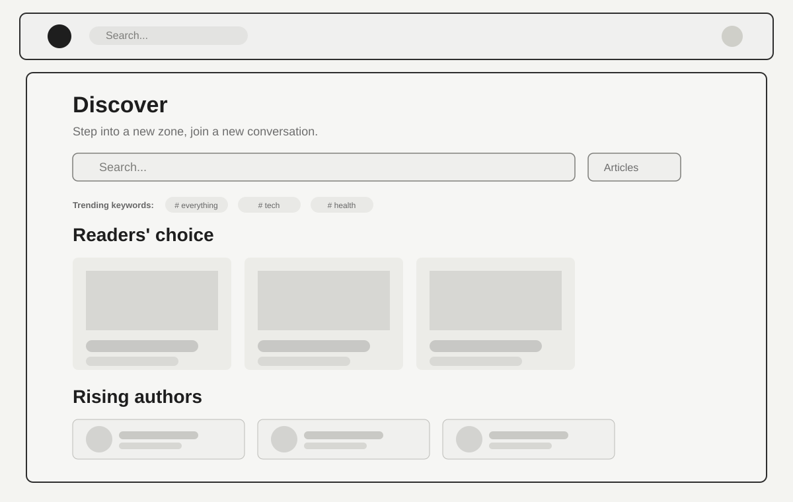
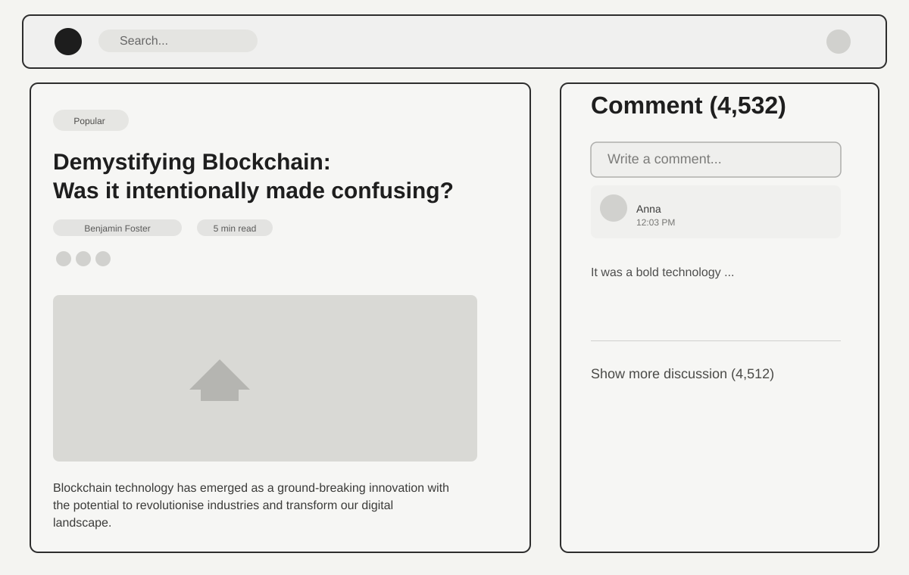
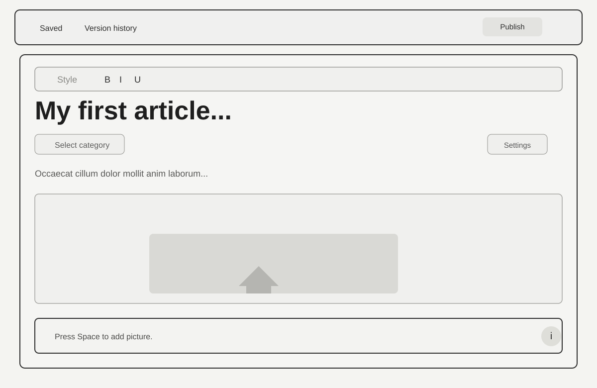

# Online Publishing Platform

## 1. Project Overview
The Online Publishing Platform is a web application designed for writers and readers to interact with digital content in a seamless and engaging manner. The platform enables authors to create, manage, and publish articles while allowing readers to discover content, follow authors, and participate in discussions.

The application should be modern, responsive, and user-friendly, designed to work efficiently across desktop and mobile devices. It should provide a structured publishing workflow for authors and an intuitive content discovery experience for readers.

## 2. Objective
Develop a publishing platform that allows:
- authors to write and publish articles,
- readers to discover trending and featured content,
- users to engage through comments and interactions,
- authors to manage drafts and schedule content,
- users to explore content by category, tag, and author.

## 3. Target Users
The platform is intended for:
- Authors / Writers
- Readers / Subscribers
- Content Editors / Moderators
- Administrators (optional enhancement)

## 4. Scope
The application will include:
- user authentication,
- article listing and searching,
- author directory and profiles,
- article detail pages,
- commenting and threaded discussion,
- article creation and publishing workflow,
- draft management and scheduling,
- tag-based discovery,
- responsive user interface.

## 5. Functional Requirements

### 5.1 User Authentication
- The system shall support social login using a free authentication service such as Auth0 or Firebase.
- Users shall be able to sign in with Google and Facebook accounts.
- The system shall support secure login and logout flows.
- User sessions shall be maintained securely and consistently.

### 5.2 Home Page and Article Listing
- The home page shall display a list of published articles.
- Each article card shall contain:
  - title,
  - thumbnail image,
  - short description,
  - author name,
  - publish date.
- The platform shall support pagination to browse large numbers of articles.
- Users shall be able to sort articles by:
  - latest,
  - most popular,
  - editor's pick.
- The platform shall include search capabilities to find articles by:
  - keyword,
  - author name.
- Featured or editor-selected articles shall be highlighted at the top of the home page.

### 5.3 Explore Authors and Articles
- The system shall provide an author directory listing all authors.
- Each author card shall display:
  - profile image,
  - short bio.
- Users shall be able to search authors by name.
- Users shall be able to open an author profile and view their published content.

### 5.4 Article Details Page
- The article detail page shall display the full article content.
- The article page shall show:
  - title,
  - author name,
  - publish date,
  - full article body.
- The page shall include the author bio.
- The page shall display other articles by the same author.
- The page shall show related articles at the end to encourage content discovery.

### 5.5 Comments and Interaction
- Users shall be able to leave comments on articles.
- The platform shall support nested or threaded comments.
- Users shall be able to sort comments by:
  - newest,
  - oldest,
  - most liked.
- The comment experience should be simple, readable, and engaging.

### 5.6 Create and Publish Articles
- The platform shall provide a rich text editor with formatting options, including:
  - bold,
  - italic,
  - underline,
  - bulleted lists,
  - numbered lists.
- Authors shall be able to insert:
  - images,
  - videos,
  - links.
- Authors shall be able to draft articles before publishing.
- The system shall allow authors to save drafts.
- The system shall support scheduling content for future publication.

### 5.7 Tags and Content Discovery
- Authors shall be able to add tags to articles.
- Users shall be able to search and browse articles by tags.
- Popular tags shall be displayed to enable content discovery.
- Tag-based browsing shall help users explore relevant content quickly.

## 6. Non-Functional Requirements

### 6.1 Performance
- The application shall load content efficiently.
- Pagination and article search should work smoothly even with large data sets.
- The UI shall remain responsive and visually smooth during navigation.

### 6.2 Usability
- The interface shall be intuitive and easy to navigate.
- The design shall be responsive for desktop, tablet, and mobile screens.
- The final experience shall feel polished, clean, and modern.

### 6.3 Security
- Authentication and session handling shall be secure.
- Private user actions shall be protected properly.
- Authorization shall be enforced for restricted functionality such as editing or publishing content.

### 6.4 Maintainability
- The application shall be structured using clear Angular architecture.
- Code shall be modular and easy to maintain.
- Components and services shall be organized logically.

### 6.5 Testability
- At least one major component and one service shall include unit tests.
- Core flows shall be tested to confirm expected behavior.
- The application should handle invalid user actions and failed requests gracefully.

## 7. Technical Expectations
- The project shall use Angular CLI.
- The application shall use a CSS preprocessor.
- At least one web worker shall be included for a background task.
- The project shall follow modern front-end development best practices.
- The codebase should demonstrate proper state management and optimization strategies.

## 8. Deliverables
The final project should include:
- fully functional web application,
- unit tests for at least one major component and one service,
- GitHub repository with source code excluding node_modules,
- deployed frontend application using a free hosting provider,
- README file containing:
  - GitHub repository link,
  - live deployment link,
  - user credentials for testing,
  - mention of bonus features, if implemented.

## 9. UI Screen Design Reference
The following screen designs represent the intended user experience and visual structure of the Online Publishing Platform. These screens should be implemented as part of the Angular application and aligned with the core functionalities described in this specification.

### 9.1 Home / Article Feed Screen
This screen presents the main reading experience for users.
- Top header with a global search field and user profile icon.
- Main article list displayed as cards with title, excerpt, metadata, and thumbnail placeholder.
- Sorting and filtering options such as category, latest, popular, or editor's pick.
- Feature area or highlighted article section at the top.
- A right-side or secondary panel may be used for drafts, saved content, or quick actions depending on the final implementation.

Reference image:

This layout should support a clean, minimal reading-first interface with strong emphasis on discoverability and readability.

### 9.2 Discover / Author Exploration Screen
This screen provides content discovery beyond the home feed.
- Search bar for content discovery.
- Category or topic chips for filtering content.
- “Readers' choice” section showing trending or curated article cards.
- “Rising authors” section displaying author profile cards with avatar, bio, and follow actions.
- Clean card-based layout to encourage browsing and exploration.

Reference image:

The design should emphasize discovery, personalization, and content exploration rather than just direct article reading.

### 9.3 Article Detail Screen with Comments
This screen presents a full article view alongside engagement features.
- Article title, author name, metadata, and content body.
- Rich media area such as a placeholder image or embedded content.
- Author info and publication metadata.
- Comment panel on the right side with a text box and sorted discussion threads.
- Threaded reply functionality and comment sort controls.

Reference image:

This design aligns with the requirement to provide article details, author context, and community interaction.

### 9.4 Article Editor / Draft Creation Screen
This screen allows authors to write and publish content.
- Top toolbar with actions such as save, preview, publish, and article settings.
- Rich text formatting tools for bold, italic, lists, links, and inline styling.
- Title field and optional category selection.
- Text editor area with placeholder article content.
- Media upload section for thumbnails or internal images.
- Save as draft, schedule, and publish actions.

Reference image:

This screen should reflect the editorial workflow and align with the rich text editing requirement.

### 9.5 Design Implementation Guidance
The final Angular application should follow the structure implied by these wireframes:
- a home/feed page for browsing content,
- a discover page for authors and trending content,
- a detail page with comments,
- an authoring page with a rich text editor,
- a consistent UI language using spacing, neutral tones, and minimal card layouts.

These visuals act as a design reference and should be adapted to the final implementation while maintaining the same overall user journey and functionality.

## 10. Evaluation Criteria
The project will be evaluated based on:
- deployment and functionality,
- architecture and project structure,
- quality of state management,
- performance optimization,
- usability and responsiveness,
- maintainability and code quality,
- bonus features and UX enhancements.

## 10. Optional / Bonus Features
The following features may be included to enhance the project:
- dark mode,
- recommended reading section,
- author follow functionality,
- article bookmarking,
- likes and reactions,
- trending topics,
- author analytics dashboard.

## 11. Final Note
The platform should feel visually appealing, responsive, and professional, with a user experience that is smooth for both writers and readers. It should demonstrate strong front-end engineering practices and provide a polished publishing experience for digital content.

---

## 12. Assignment-Friendly Summary
This project is to build a modern content publishing platform using Angular that allows users to read, search, filter, and engage with articles, while also enabling authors to create, manage, and publish content. The focus is on responsive UI design, rich editorial tools, user authentication, and smooth content discovery.
